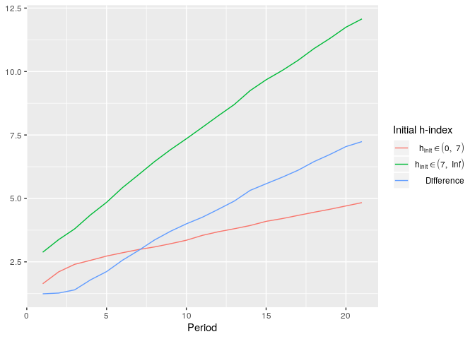
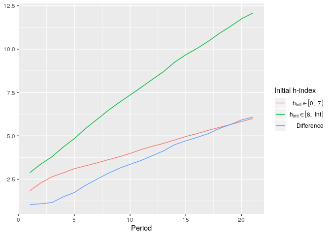

<!-- README.md is generated from README.Rmd. Please edit that file -->
hindex
======

<!-- badges: start -->
<!-- badges: end -->
This package provides functionality to simulate the development of h-index and h-alpha values of scientists who collaborate on writing papers and to visualize the simulated data. The effect of publishing, being cited, and strategic collaborating can be simulated. The implementation is based on the STATA ado [h-index](https://github.com/chrgan/h_index).

Installation
------------

Install the package from CRAN:

``` r
install.packages('hindex')
```

Install the latest version from [GitHub](https://github.com) using the devtools package:

``` r
# if devtools is not installed yet:
install.packages("devtools")

devtools::install_github("atekles/hindex")
```

Example
-------

``` r
library(hindex)
set.seed(1234)
simdata <- simulate_hindex(runs = 5, n = 200, periods = 20, coauthors = 3, distr_initial_papers = 'poisson', dpapers_pois_lambda = 10, distr_citations = 'poisson', dcitations_mean = 5, dcitations_peak = 3, alpha_share = .33)
#> run 1...
#> run 2...
#> run 3...
#> run 4...
#> run 5...
plot_hsim(simdata, plot_hindex = TRUE)
```


``` r
plot_hsim(simdata, plot_halpha = TRUE, group_boundaries = 'median', exclude_group_boundaries = TRUE, plot_group_diffs = TRUE)
```



``` r
plot_hsim(simdata, plot_halpha = TRUE, group_boundaries = list(c(0, 7), c(8, Inf)), plot_group_diffs = TRUE)
```



``` r
simdata <- simulate_hindex(runs = 5, n = 200, periods = 20, subgroups_distr = .5, coauthors = 3, distr_initial_papers = 'poisson', dpapers_pois_lambda = 10, distr_citations = 'poisson', dcitations_mean = 5, dcitations_peak = 3, alpha_share = .33)
#> run 1...
#> run 2...
#> run 3...
#> run 4...
#> run 5...
plot_hsim(simdata, plot_hindex = TRUE, subgroups = TRUE, plot_group_diffs = TRUE)
```


